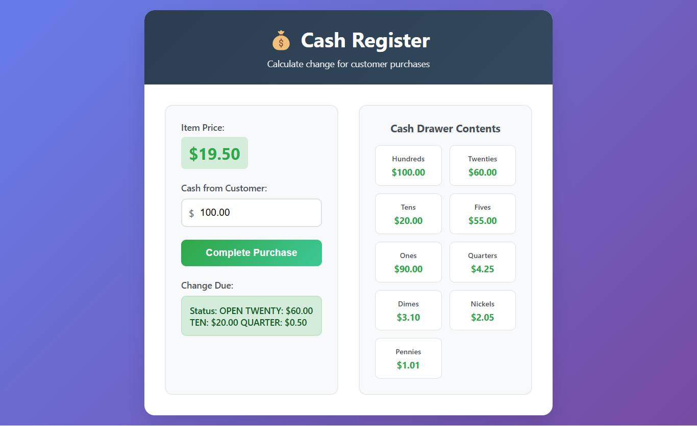

# 💰 Cash Register App


A professional cash register application that calculates change for customer purchases with accurate currency breakdown. Features real-time cash drawer display, comprehensive error handling, and support for all standard US currency denominations.

## 📸 Screenshots

<div align="center">
  
  <p><em>Professional cash register interface with change calculation and drawer display</em></p>
</div>

## ✨ Live Demo

🌐 **[View Live Demo](https://your-live-demo-link.com)** *(Update after deployment)*

## 🚀 Key Features

- **💵 Change Calculation**: Accurate change calculation with proper currency breakdown
- **🏦 Cash Drawer Display**: Real-time display of available currency in the drawer
- **⚠️ Error Handling**: Comprehensive validation for insufficient funds and invalid inputs
- **💱 Currency Breakdown**: Change given from highest to lowest denomination
- **📱 Responsive Design**: Works perfectly on all devices and screen sizes
- **🎯 Status Messages**: Clear feedback with INSUFFICIENT_FUNDS, CLOSED, and OPEN statuses
- **⚡ Real-time Updates**: Instant calculation and display updates

## 🎨 Design Features

### User Interface
- **Modern Layout**: Clean, professional cash register design
- **Currency Display**: Visual representation of cash drawer contents
- **Input Validation**: Real-time feedback for user inputs
- **Status Indicators**: Clear visual status messages

### Functionality
- **Exact Change**: Handles exact payment scenarios
- **Insufficient Funds**: Alerts when customer doesn't have enough money
- **Change Breakdown**: Detailed breakdown by currency denomination
- **Drawer Management**: Tracks available currency in the cash drawer

## 📱 Core Functionality

1. **💰 Price Display** - Shows current item price ($19.50 default)
2. **💵 Cash Input** - Customer payment amount input with validation
3. **🧮 Change Calculation** - Automatic change calculation with currency breakdown
4. **🏦 Drawer Display** - Real-time cash drawer contents visualization
5. **⚠️ Error Handling** - Comprehensive error messages and validation

## 🛠️ Tech Stack

- **⚡ Frontend**: HTML5, CSS3, Vanilla JavaScript
- **🎨 Styling**: CSS Grid, Flexbox, Modern UI components
- **📱 Responsive**: Mobile-first responsive design
- **🧮 Logic**: Advanced change calculation algorithms
- **💱 Currency**: Support for all US currency denominations

## 🚀 Getting Started

### Prerequisites

- Modern web browser (Chrome, Firefox, Safari, Edge)
- Basic understanding of US currency system

### Installation

1. **Clone the repository**
   ```bash
   git clone https://github.com/your-username/cash-register-app.git
   cd cash-register-app-shibam
   ```

2. **Open the application**
   ```bash
   # Option 1: Open directly in browser
   open index.html
   
   # Option 2: Use a local server (recommended)
   python -m http.server 8000
   # or
   npx serve .
   ```

3. **Start using the cash register**
   - Enter customer payment amount
   - Click "Complete Purchase" to calculate change
   - View change breakdown and updated drawer contents

## 📁 Project Structure

```
cash-register-app-shibam/
├── 📄 index.html              # Main HTML structure
├── 🎨 styles.css              # Styling and responsive design
├── ⚡ script.js               # Cash register logic and calculations
├── 📸 screenshot/             # Application screenshots
├── 📖 README.md               # Project documentation
├── 📜 LICENSE                 # MIT License
└── 🚫 .gitignore              # Git ignore rules
```

## 🛠️ Technologies Used

<table>
<tr>
<td align="center"><br><b>HTML5</b></td>
<td align="center"><br><b>CSS3</b></td>
<td align="center"><br><b>JavaScript</b></td>
<td align="center"><br><b>Git</b></td>
</tr>
</table>

## 🎯 Algorithm Features

### Change Calculation Logic
- **Cent-based Calculations**: Avoids floating-point precision issues
- **Greedy Algorithm**: Optimal change-making using largest denominations first
- **Currency Validation**: Ensures proper currency denomination handling
- **Edge Case Handling**: Manages exact change and insufficient funds scenarios

### Supported Currency Denominations
- **Bills**: $100, $20, $10, $5, $1
- **Coins**: Quarter ($0.25), Dime ($0.10), Nickel ($0.05), Penny ($0.01)

### Status Management
- **INSUFFICIENT_FUNDS**: When customer payment is less than item price
- **CLOSED**: When exact change cannot be made with available currency
- **OPEN**: When change can be successfully calculated and dispensed

## 🧮 Usage Examples

### Scenario 1: Normal Transaction
- **Item Price**: $19.50
- **Customer Payment**: $20.00
- **Change Due**: $0.50 (2 quarters)
- **Status**: OPEN

### Scenario 2: Exact Payment
- **Item Price**: $19.50
- **Customer Payment**: $19.50
- **Change Due**: No change due - customer paid with exact cash
- **Status**: OPEN

### Scenario 3: Insufficient Funds
- **Item Price**: $19.50
- **Customer Payment**: $15.00
- **Result**: Alert - "Customer does not have enough money to purchase the item"

## 🌐 Deployment

### 🚀 Quick Deploy Options

1. **GitHub Pages**
   - Push to GitHub repository
   - Enable GitHub Pages in repository settings
   - Access via `https://username.github.io/repository-name`

2. **Netlify**
   - Drag and drop project folder to Netlify
   - Get instant live URL with HTTPS

3. **Vercel**
   - Import GitHub repository
   - Zero-configuration deployment

## 📊 Performance Features

- **Efficient Algorithms**: Optimized change calculation logic
- **Minimal Dependencies**: Pure vanilla JavaScript for maximum performance
- **Fast Rendering**: Optimized DOM manipulation
- **Responsive Design**: Smooth performance across all devices

## 🔧 Available Scripts

```bash
# Development
python -m http.server 8000    # Start local development server
npx serve .                   # Alternative local server

# Testing
# Open browser console to test different scenarios
# Modify price and cid variables for testing
```

## 🧪 Testing Scenarios

The app handles various test cases including:
- Exact change payments
- Insufficient customer funds
- Insufficient drawer funds
- Complex change-making scenarios
- Edge cases with multiple currency denominations

## 📝 License

This project is open source and available under the [MIT License](LICENSE).

## 🤝 Contributing

Contributions, issues, and feature requests are welcome! Feel free to check the [issues page](https://github.com/your-username/cash-register-app/issues).

## 📞 Contact

**Shibam Banerjee**
- Email: Connect-With-Shibam@outlook.com
- Phone: +91 62902-18960
- LinkedIn: [linkedin.com/in/shibam-webdev](https://linkedin.com/in/shibam-webdev)
- GitHub: [github.com/Shibam-Code-Pro](https://github.com/Shibam-Code-Pro)

## 🙏 Acknowledgments

- [freeCodeCamp](https://www.freecodecamp.org/) for the algorithm challenge inspiration
- [MDN Web Docs](https://developer.mozilla.org/) for JavaScript documentation
- [CSS-Tricks](https://css-tricks.com/) for responsive design techniques

---

⭐ **If you found this project helpful, please give it a star!** ⭐
